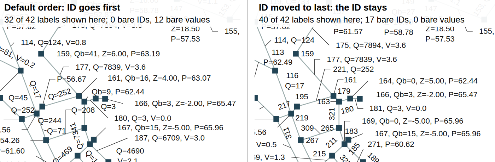

# Label placement, round 7 (2026-10-07): the self-test, the catalogue, and the close of phase 1

**Builders must not read this file or `dev/label-trials/`.** It scores with the judges' tools.

Tasks 741 and 539. Part 1, the protocol, is `dev/label-trials/round-7-plan.md` §4, in its final form
at commit `fec99db8` (builders frozen, before any scoring). Every number below comes from
`round-7/results.md`, which `round-7/analyse.js` generates from the raw lines in `round-7/raw/`; H3
from `round-7/h3-ablations.md` (`ablate.js`); the judges' secret tests from `round-7/judges-out/`.
Phase 1 is summed up for phase 2 in `dev/label-trials/phase-1-summary.md`.

---

## Part 2: Results and analysis

### 2.1 What ran

The four builders continued from round 6 with the self-test (`room-check.js`) and the strategy
catalogue (`dev/label-placement-strategies.md`), and were frozen at A `2883c033`, B `18cac708`,
C `4dc27ea1`, D `2e5e81c4` (`round-7/frozen/`, with their strategy cards). 99 scene sets (64 fresh
secret E1 sets on seeds 71-74, 3 networks of 20,000 nodes, round 6's 32 bent-and-valved sets, and
the 6 public sets): **1,012 cells, 5,060 views, one worker, no cell failed or timed out**, about
2.5 hours on jasmine beside other suites. Then 144 ablation cells for H3 and the judges' secret tests
on each round-7 placer.

### 2.2 Deviations from the protocol

1. **H3 ran on a sample**, not all of E1: 8 secret sets (each family, plain and bent-and-valved,
   seed 71, 28 px, the crowded density), every claim a card made of at least one label in 100. With
   one worker the full E1 would have taken another 3 hours per builder.
2. **A column added to the analysis after scoring started**: "most-wanted value %" (round 6's
   metric), to check the drop-order confound below. Nothing pre-registered was changed.
3. **A correction to the plan's "known before scoring" note.** It said the round-6 placers would
   show narrow bare IDs everywhere. They do so only on the public scenes, whose drop order names no
   `id` (their most-wanted value % there is 38-53% against 84-88% for round 7). The generated scenes
   list `id` first explicitly, and on them the round-6 placers drop it like everyone else (most-
   wanted value % equals labels shown % for every entrant in E1, E2 and E3). So **H1 and H2 on E1
   are not confounded by the drop order.**

### 2.3 Disclosure: builder B saw the held-back part of the rules

B reported it: a `sed` range meant for Part A of `dev/label-placement-rules.md` ran past it and
printed Part B and §6, which describe the 12345678 test (R-075), Tom's two screenshots, and his
numeric crossing weights. B says it opened nothing under `judges/` or `dev/label-trials/` and built
nothing aimed at what it saw.

**How we treat it.** B's results on R-075 and the screenshot assertions are reported below but
**marked "not blind" and left out of every comparison between builders** on those tests. The
evidence that it did not help: B came third of four on R-075 (2.4% of shown labels lost with room;
C 0.7%, A 1.0%, D 3.6%), and every builder passed the screenshot assertions. B has the lowest Tom-
weighted crossing cost, which B could have tuned to, but it also has the lowest cost by rank (312 on
the public scenes against A 653, D 1,100, C 1,948), which needs no weights, and its card explains it
by its own `cleanfirst` ingredient. So B's crossing lead stands, read on the ranked cost. **For round
8, Part B moves out of the file builders read** (2.8).

### 2.4 The hypotheses

- **H1 (the self-test helps): supported.** Every builder left less realizable room than its round-6
  self on all 64 of 64 secret E1 sets (A -2.3, B -4.7, C -1.2, D -3.5 labels per 100 requested that a
  strict repair could still have added; Holm p < 0.001 each), and showed 6 to 10 points more labels,
  not fewer.
- **H2 (beyond the plain recipe): supported.** Every builder shows more labels than R (round 6's C
  plus the strict repair pass) on E1, by 3.7 (D) to 5.1 (A) points, 64 of 64 sets each, with fewer
  labels over leaders (0.00-0.07 per 100 against R's 0.59).
- **H3 (the strategies are real): supported.** All 14 card claims of at least one label in 100
  replicate in sign on the secret sample, 13 of them on 8 of 8 sets. Most replicate in size too;
  A's eviction (S16) does not (3.2 claimed, 0.5 found). Table: `round-7/h3-ablations.md`.
- **H4 (R10): supported.** No round-7 view over one second in E1 or E2 (worst 713 ms, B; medians
  61-161 ms). At 20,000 nodes the worst was 707 ms.
- **H5 (the tool, not the space): supported.** The public and held-back room scores rank the eight
  placers alike (Kendall tau 0.71). The builders learned the space, not just the tool's blind spots.
- **H6 (never by count): supported.** Far labels revived beyond control flips: A 3.2%, B 2.6%, C 1.1%,
  D 0.3%, all under 5%. A and B also flip labels between two identical runs (119 and 484 in the
  control), because their layouts stop on a clock.

### 2.5 The headline

E1, 64 fresh secret sets of 1,000 nodes, pooled:

| | labels shown | values shown | hidden with room (public / held-back) | still addable (realizable, per 100) | label on pipe per 100 | Tom cost per label | pipe labels along | ms median / worst |
|---|---|---|---|---|---|---|---|---|
| **A7** | **78.8%** | **52.1%** | 13.0% / 5.8% | **0.40** | 8.7 | 0.037 | 54% | 161 / 553 |
| **B7** | 78.7% | 49.8% | 7.4% / 7.1% | 0.57 | **5.9** | **0.018** | 63% | 76 / 713 |
| **C7** | 78.1% | 51.4% | 9.3% / **4.7%** | 0.41 | 31.7 | 0.107 | 51% | 77 / 465 |
| **D7** | 77.8% | 50.3% | **6.1%** / 4.8% | 0.42 | 17.1 | 0.056 | **70%** | **61** / 657 |
| R (C6 + repair) | 73.8% | 48.9% | 7.5% / 4.1% | 0.00 | 30.1 | 0.103 | 59% | 45 / 492 |
| M (measurer alone) | 76.6% | 49.5% | 11.8% / 7.4% | 0.31 | 0.0 | 0.046 | 8% | 77 / 946 |
| round 6, best (C6) | 71.8% | 48.1% | 18.4% / 14.3% | 1.69 | 30.9 | 0.100 | 61% | 16 / 195 |

**The ranking.** On labels and values together **A7 leads**: more labels than B7 on 43 of 64 sets
(21 fewer), than C7 on 54, than D7 on 50, and more values than each on 55 to 63 of 64. But the four
are within one point of each other on labels, and each leads somewhere else: **B7 is the cleanest**
(fewest crossings by rank and by Tom's weights, almost no leaders across pipes), **D7 honours the
alignment setting most (70% along) and leaves the least room by the public measure, and is the
fastest**, **C7 leaves the least room by the held-back measure** but sets the most labels across
pipes. The step from round 6 to round 7 (6 to 10 points of labels, 4 to 10 of values, room left
cut by a half to five sixths) is many times larger than the gaps between the builders.

Zooming and stability (E1): churn 6.5% (A) to 10.5% (D) of compared labels, up from round 6 for A
and B, mostly pipe labels turning along their pipe as room opens (a move that shows nothing more, so
it counts). Rows lost on zoom-in stayed under 4% of rows regained for all four (A 0.7%, D 3.5%).

### 2.6 The judges' secret tests on the round-7 placers (public Novato sets)

| | R-075: shown labels the long IDs hid or cut where room was | screenshots (overwrite-185-183, gang-runs-south) | R14 close zoom (at most 5%) | R13 |
|---|---|---|---|---|
| A7 | 1.0% | all pass | 3.5% pass | pass |
| B7 (**not blind**, 2.3) | 2.4% | all pass | **10.1% fail** | pass |
| C7 | 0.7% | all pass | 3.4% pass | pass |
| D7 | 3.6% | all pass | 2.9% pass | pass |

### 2.7 "Emergent ability or delusion?" (Tom's question about the bench)

**Neither, quite.** The bench's measurer is a plain search, every 15 degrees and every half row, that
asks a narrower question than placing labels does: for one hidden label, in a map that is already
finished, is there a gap near it? It cannot "place labels" in the sense he means, because placing
means deciding for all the labels at once, and every label you seat takes ground from the next.

- **Where it is real.** As a ruler it ranks placers the way a stricter ruler does (H5). As an
  ingredient it works: built into the placers this round (every builder used its search, S15) it
  helped cut the room they leave (public measure) by a half (C) to five sixths (D). Used alone as a placer it shows 76.6% of
  labels, close to the builders.
- **Where its number deludes.** All four builders found, independently, that most of what it calls
  "room" is unusable: ground **under another label's leader** (B: 147 of 173 of its "room" spots in
  B's layouts; D: about 210 of 242; C: about 131 of 148), or **a pipe label sitting on its own pipe**,
  exactly where R7 says not to be. Its headline percentage therefore overstates real room several
  times over; the held-back and realizable scores, which refuse that ground, say what is left is
  about 4-7% of hidden labels, and about one label in 200 that could actually still be added.
- **His posit**, *"anybody who is smart enough to evaluate success is smart enough to place labels"*,
  half holds. The evaluator alone (M) gets most of the way on how many labels show, and fails on
  everything else a reader sees: pipe labels lie level (8% along, against 51-70%), 3.7 labels per 100
  sit on leaders (builders: about none), it remembers nothing between zooms (the most churn) and it
  is the slowest at its worst (946 ms). Judging one label is easy; the order in which all of them are
  seated is the hard part, and that is what the builders' recipes are about.

### 2.8 Bench defects the four builders reported, and what they do to the scores

All four reported these independently. Each is weighed here and has a fix for round 8.

| Defect | Effect on this round's scores | Fix for round 8 |
|---|---|---|
| `room-check` counts ground under another label's leader as room | Its public "hidden with room" overstates; that is why the held-back and realizable scores exist. Rankings by it agree with the stricter one (H5) | Refuse a block over another label's leader and a leader through another label's text in the public search (as `room-held.js` does); keep the finer reach held back |
| `room-check` exempts a pipe label's own pipe, so "room" can be on the pipe (the R7 case) | Overstates room for pipe labels, in every score here including held-back and realizable (they share the exemption) | Exempt only the label's anchor point; require a pipe label to sit beside its pipe |
| `segHitsBox` shrinks every box by 1.5 px, so N3 lets a leader pass about 1 px from a small node's centre | Lets every placer and the measurer use leaders that graze through junctions; same for all, so rankings hold | Shrink by a fraction of the box (or not at all for symbols under 6 px); state the tolerances in Part A §5 |
| R14's `alignedRoom` ignores leaders | "Had room to lie along" counts spots on a leader; B's 10.1% close-zoom fail may include some | Add leaders to its obstacles |
| The 3000 ms opening idle hides cold-start cost | The first view's time reads about 0 ms for a placer that lays it out in the pause (D's cold opening ran past 700 ms) | Report the opening view's time with the idle included, or score a cold view separately |
| No public scene has page furniture | A placer could ignore `scene.furniture` and pass (D did until this round) | Add furniture to one public scene and to the generated ones |
| `run.js` has no worker option | None; it was always one process. Briefs saying "one worker" confused builders | Say so in the README |
| Old public scenes do not list `id` in the drop order | Every placer now drops the ID first on them (2.9); the round-6 placers broke the order there | Re-extract the public scenes with the app's actual default drop order once Tom answers 2.9 |
| Part B of the rules is in the file builders read | B read it by accident (2.3) | Move Part B and §6 into a judges-only file |

### 2.9 For Tom: what a crowded label keeps, now that the ID drops like any value

The app's default drop order does not name the ID, and the contract (on his 2026-10-06 yes, *"Keep
the last dropped property"*) treats an unnamed ID as first to go. So on a crowded view every placer
now keeps a bare value such as **P=94.65** or **Q=252**, with no ID to say which node or pipe it
belongs to. `round-7/drop-order-novato.png` shows the same Novato view laid out by C7 twice:

Left, the default: 32 of 42 labels shown here, 12 of them a bare value. Right, the ID moved to last:
40 of 42 shown, 17 of them a bare ID. (IDs are narrower, so more fit.)

### 2.10 Threats to validity

- **Times are from one shared machine**, and three of the four placers stop improving on a clock, so
  a slower machine would show fewer values (not fewer labels) and a different layout.
- **The room measures share blind spots** (the own-pipe exemption, the 1.5 px shrink), so "room left"
  is still somewhat overstated in every score.
- **H3 ran on 8 sets**, at one density.
- **Builder B read the held-back rules** (2.3).
- **Legibility to a person is not measured.** Whether "P=94.65" without an ID helps on a crowded map
  is his call (2.9).

---

## Proposals for Tom

1. **At a crowded view, should a label keep a bare value (today's default: "P=94.65") or a bare ID?**
   The picture in 2.9 shows both. Either way it is the user's drop order that decides; the question is
   only what the default order should say about the ID.
2. **Close phase 1 as he proposed**, with `dev/label-trials/phase-1-summary.md` as the write-up: the
   dozen strategies that measured best, with their worth, offered as the state of the art to phase 2.
3. **Fix the bench defects in 2.8 before round 8**, the room search first (no room under leaders,
   none on a pipe label's own pipe).
